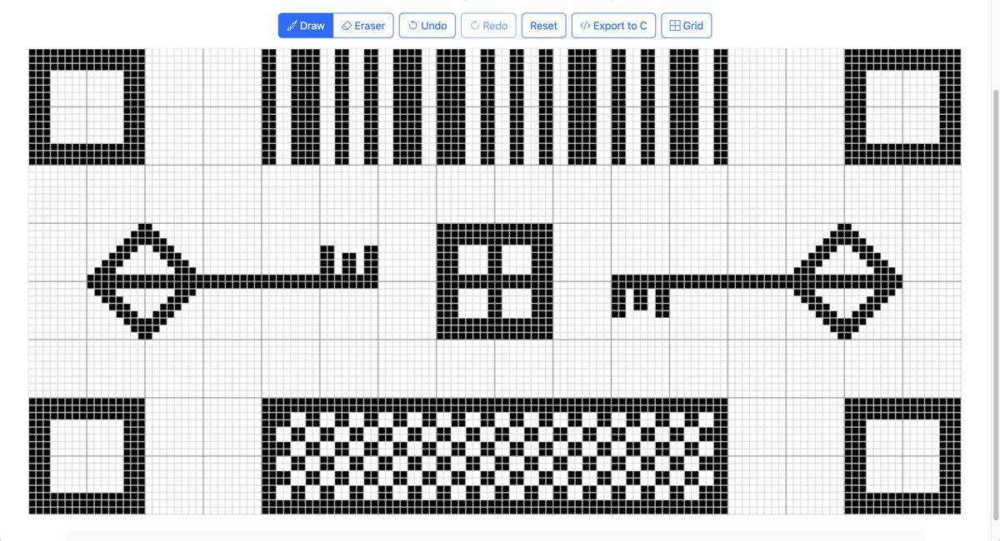
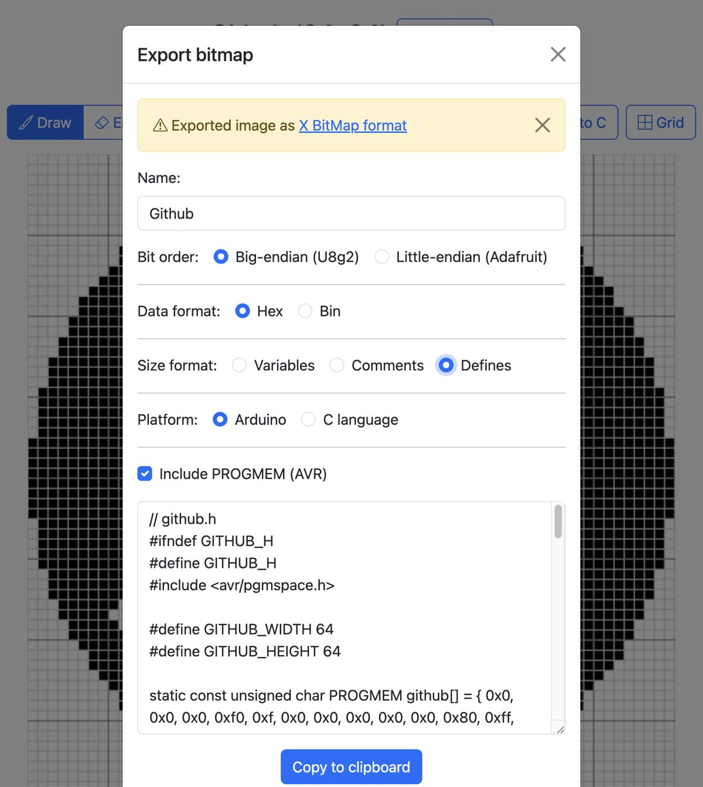
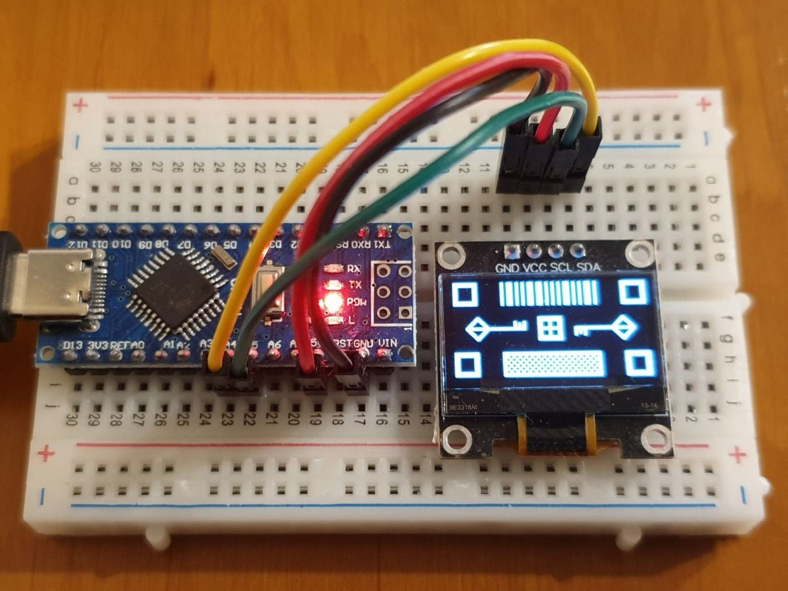
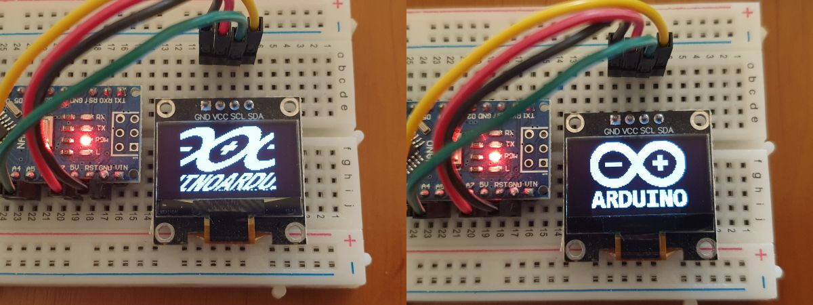

# Bitmap Editor

✨ Open source editor for [bitmap](https://en.wikipedia.org/wiki/X_BitMap) images.

👍 Will help you create pictures for libraries [U8g2](https://github.com/olikraus/u8g2) and [Adafruit SSD1306](https://github.com/adafruit/Adafruit_SSD1306).

👉 [Bitmap Editor website](https://pkolt.github.io/bitmap_editor/)

## Usage

### Create bitmap from image



### Export bitmap



### Download bitmap to your device



## Examples

### Arduino + Adafruit SSD1306

If you are using library [Adafruit SSD1306](https://github.com/adafruit/Adafruit_SSD1306):

```cpp
#include <Wire.h>
#include <Adafruit_GFX.h>
#include <Adafruit_SSD1306.h>

#define SCREEN_WIDTH 128  // OLED display width, in pixels
#define SCREEN_HEIGHT 64  // OLED display height, in pixels

#define OLED_RESET -1        // Reset pin # (or -1 if sharing Arduino reset pin)
#define SCREEN_ADDRESS 0x3C  ///< See datasheet for Address; 0x3D for 128x64, 0x3C for 128x32
Adafruit_SSD1306 display(SCREEN_WIDTH, SCREEN_HEIGHT, &Wire, OLED_RESET);

#define BITMAP_WIDTH 16
#define BITMAP_HEIGHT 16

static const unsigned char PROGMEM bitmap[] = { 0b00000001, 0b00000000, 0b00000011, 0b10000000, 0b00101001, 0b00101000, 0b00010001, 0b00010000, 0b00101001, 0b00101000, 0b00000101, 0b01000000, 0b01000011, 0b10000100, 0b11111111, 0b11111110, 0b01000011, 0b10000100, 0b00000101, 0b01000000, 0b00101001, 0b00101000, 0b00010001, 0b00010000, 0b00101001, 0b00101000, 0b00000011, 0b10000000, 0b00000001, 0b00000000, 0b00000000, 0b00000000 };

void setup() {
  Serial.begin(9600);

  // SSD1306_SWITCHCAPVCC = generate display voltage from 3.3V internally
  if (!display.begin(SSD1306_SWITCHCAPVCC, SCREEN_ADDRESS)) {
    Serial.println(F("SSD1306 allocation failed"));
    for (;;)
      ;  // Don't proceed, loop forever
  }

  display.clearDisplay();

  display.drawBitmap(0, 0, bitmap, BITMAP_WIDTH, BITMAP_HEIGHT, SSD1306_WHITE);
  display.display();
}

void loop() {
}
```

### Arduino + U8g2

If you are using library [U8g2](https://github.com/olikraus/u8g2):

```cpp
#include <Arduino.h>
#include <U8g2lib.h>
#include <Wire.h>

U8G2_SSD1306_128X64_NONAME_F_HW_I2C u8g2(U8G2_R0, /* reset=*/U8X8_PIN_NONE);

#define BITMAP_WIDTH 16
#define BITMAP_HEIGHT 16

static const unsigned char PROGMEM bitmap[] = { 0b10000000, 0b00000000, 0b11000000, 0b00000001, 0b10010100, 0b00010100, 0b10001000, 0b00001000, 0b10010100, 0b00010100, 0b10100000, 0b00000010, 0b11000010, 0b00100001, 0b11111111, 0b01111111, 0b11000010, 0b00100001, 0b10100000, 0b00000010, 0b10010100, 0b00010100, 0b10001000, 0b00001000, 0b10010100, 0b00010100, 0b11000000, 0b00000001, 0b10000000, 0b00000000, 0b00000000, 0b00000000 };

void setup(void) {
  pinMode(9, OUTPUT);
  digitalWrite(9, 0);  // default output in I2C mode for the SSD1306 test shield: set the i2c adr to 0

  if (!u8g2.begin()) {
    Serial.println(F("SSD1306 allocation failed"));
    for (;;)
      ;  // Don't proceed, loop forever
  };

  u8g2.clearDisplay();
  u8g2.drawXBMP(0, 0, BITMAP_WIDTH, BITMAP_HEIGHT, bitmap);
  u8g2.sendBuffer();
}

void loop(void) {}
```

## Development

```bash
npm ci
npm start
```

## FAQ

### Why is my image distorted?



For some LCD displays such as the SSD1306, the image width must be a multiple of 8. If this requirement is not met, you will see a distorted image when displayed.

Just use an image width that is a multiple of 8.
